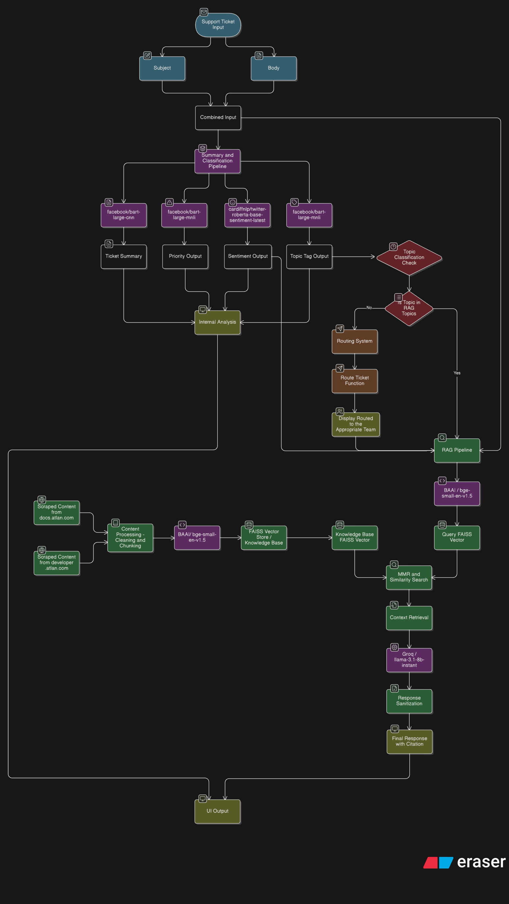

# 🛟 Atlan Customer Support Copilot

An AI-powered customer support system that automatically classifies support tickets and provides intelligent responses using RAG (Retrieval-Augmented Generation) technology.

## 📋 Key Features

- ✅ **Bulk Ticket Classification**: Automatically processes and classifies support tickets
- ✅ **Interactive AI Agent**: Provides intelligent responses with proper routing
- ✅ **RAG Pipeline**: Generates contextual answers using Atlan's documentation
- ✅ **Smart Routing**: Routes tickets to appropriate teams when needed
- ✅ **Multi-Channel Support**: Handles email, chat, and other communication channels
- ✅ **Source Citations**: All responses include proper documentation references

## 🎯 Overview

This system demonstrates a complete AI pipeline for customer support automation, combining intelligent classification with contextual response generation. The system automatically processes incoming support tickets, classifies them by topic and priority, and either provides immediate AI-generated responses or routes them to the appropriate human support team.

## 🏗️ Architecture

### High-Level System Overview



## 📋 Detailed System Architecture Explanation

This comprehensive flowchart illustrates the complete support ticket processing and resolution system, incorporating both traditional routing mechanisms and the Retrieval Augmented Generation (RAG) pipeline. The diagram shows the sophisticated dual-path approach with intelligent classification, conditional routing, knowledge base preparation, and response generation.

### 🔄 **Stage 1: Support Ticket Input and Initial Processing**

**Input Components:**
- **Support Ticket Input**: The entry point where customer support tickets are received through various channels (email, chat, etc.)
- **Subject & Body Separation**: The system intelligently separates the ticket into two key components:
  - **Subject**: Contains the main topic or issue summary
  - **Body**: Contains detailed description, context, and specific requirements
- **Combined Input**: Both components are merged into a unified text input for processing

**Purpose**: This stage ensures that all relevant information from the customer's ticket is captured and prepared for analysis, regardless of the input channel or format.

### 🧠 **Stage 2: Summary and Classification Pipeline**

This is the core AI processing stage where multiple specialized language models work in parallel to analyze the ticket:

**Model Components:**
- **facebook/bart-large-cnn**: Generates concise, accurate ticket summaries that capture the essence of the customer's issue
- **facebook/bart-large-mnli**: Performs two critical classification tasks:
  - **Priority Classification**: Determines urgency level (P0, P1, P2) based on business impact and customer sentiment
  - **Topic Classification**: Identifies the subject matter (Lineage, API/SDK, Connector, etc.) using zero-shot classification
- **cardiffnlp/twitter-roberta-base-sentiment-latest**: Analyzes customer sentiment (Positive, Negative, Neutral) to understand emotional context

**Outputs:**
- **Ticket Summary**: Clean, structured summary for quick understanding
- **Priority Output**: Business-critical priority level for routing decisions
- **Sentiment Output**: Customer emotional state for appropriate response tone
- **Topic Tag Output**: Categorized subject matter for intelligent routing

### 🎯 **Stage 3: Internal Analysis and Decision Logic**

**Analysis Convergence:**
- **Internal Analysis**: Combines summary, priority, and sentiment data to create a comprehensive understanding of the ticket
- **Topic Classification Check**: Evaluates whether the identified topic requires technical expertise
- **RAG Topics Decision**: Determines if the ticket should be processed through the RAG pipeline or traditional routing

**Decision Criteria:**
- **RAG Topics**: Technical subjects like Lineage, API/SDK, Connectors, Integrations, Best Practices
- **Non-RAG Topics**: General inquiries, billing, account management, feature requests

### 🛣️ **Stage 4: Routing System (Traditional Path)**

**For Non-Technical Queries:**
- **Routing System**: Analyzes the ticket classification to determine the appropriate support team
- **Route Ticket Function**: Executes the routing logic based on topic, priority, and sentiment
- **Display Routed Message**: Provides clear communication to the customer about team assignment

**Routing Logic:**
- **High Priority + Negative Sentiment**: Immediate escalation to senior support
- **Billing/Account Issues**: Route to customer success team
- **Feature Requests**: Route to product team
- **General Inquiries**: Route to general support team

### 🗄️ **Stage 5: Knowledge Base Preparation (Parallel Process)**

**Content Acquisition:**
- **Scraped Content from docs.atlan.com**: Comprehensive product documentation, guides, and tutorials
- **Scraped Content from developer.atlan.com**: Technical API documentation, SDK references, and integration guides

**Content Processing:**
- **Content Processing - Cleaning and Chunking**: 
  - Removes HTML tags, navigation elements, and irrelevant content
  - Splits documents into optimal chunks for retrieval
  - Preserves semantic meaning and context
  - Handles code blocks, tables, and structured content

**Vector Store Creation:**
- **BAAI/bge-small-en-v1.5**: State-of-the-art embedding model for semantic understanding
- **FAISS Vector Store**: High-performance similarity search database
- **Knowledge Base FAISS Vector**: Optimized vector database ready for real-time queries

### 🤖 **Stage 6: RAG Pipeline (Retrieval Augmented Generation)**

**For Technical Queries:**

**Query Processing:**
- **BAAI/bge-small-en-v1.5**: Converts the customer's question into high-dimensional vector representation
- **Query FAISS Vector**: Performs semantic similarity search against the knowledge base
- **Knowledge Base FAISS Vector**: Provides relevant documentation chunks based on semantic similarity

**Context Retrieval:**
- **MMR and Similarity Search**: Uses Maximum Marginal Relevance to ensure diverse, relevant results
- **Context Retrieval**: Gathers the most relevant documentation chunks for the specific query

**Response Generation:**
- **Groq / llama-3.1-8b-instant**: Fast, efficient language model that generates accurate, contextual responses
- **Response Sanitization**: Ensures responses are safe, professional, and free from harmful content
- **Final Response with Citation**: Provides comprehensive answers with proper source attribution

### 🎨 **Stage 7: UI Output and User Experience**

**Unified Output:**
- **Display Routed to Team**: Clear communication for traditional routing
- **Final Response with Citation**: Comprehensive technical answers with source links
- **UI Output**: Professional, user-friendly interface that presents results clearly

**User Experience Features:**
- **Real-time Processing**: Fast response times for both routing and RAG queries
- **Source Transparency**: All RAG responses include clickable source citations
- **Professional Presentation**: Clean, organized display of classification results and responses
- **Multi-channel Support**: Consistent experience across email, chat, and other channels

### 🔧 **Technical Implementation Details**

**Model Selection Rationale:**
- **RoBERTa for Sentiment**: Proven performance on social media and customer communication
- **BART for Classification**: Excellent zero-shot performance for topic and priority classification
- **BGE Embeddings**: State-of-the-art multilingual embeddings optimized for retrieval
- **Groq LLM**: Fast inference with high-quality responses for real-time support

**Performance Optimizations:**
- **Parallel Processing**: Multiple models run simultaneously for faster classification
- **Vector Caching**: Pre-computed embeddings for instant retrieval
- **Smart Chunking**: Optimal document segmentation for better context retrieval
- **Fallback Mechanisms**: Graceful degradation when models or services are unavailable

**Quality Assurance:**
- **Response Sanitization**: Prevents harmful or inappropriate content
- **Source Verification**: Ensures all citations are valid and accessible
- **Confidence Scoring**: Provides reliability indicators for generated responses
- **Human-in-the-Loop**: Easy escalation to human agents when needed

This architecture represents a production-ready, scalable solution that combines the efficiency of AI automation with the reliability of traditional support routing, ensuring customers receive accurate, helpful responses while maintaining the human touch when needed.

## 🚀 Application Features

### Bulk Dashboard
- Automatically loads and classifies sample tickets
- Displays detailed classification results (Topic, Sentiment, Priority)
- Supports CSV/JSON file uploads
- Download classification results

### Interactive Agent
- Multi-channel support (email, chat, WhatsApp, voice)
- Real-time ticket analysis and classification
- Intelligent response generation with source citations
- Automatic team routing for non-RAG topics

### RAG Pipeline
- Scrapes Atlan documentation (`docs.atlan.com`, `developer.atlan.com`)
- Generates contextual answers with proper citations
- Quality detection and fallback mechanisms
- Supports multiple retrieval strategies

## 🛠️ Technology Stack

### AI Models
- **Sentiment Classification**: `cardiffnlp/twitter-roberta-base-sentiment-latest`
- **Topic & Priority Classification**: `facebook/bart-large-mnli`
- **Summarization**: `facebook/bart-large-cnn`
- **Embeddings**: HuggingFace `BAAI/bge-small-en-v1.5` (primary), OpenAI `text-embedding-3-small` (optional)
- **Generation**: Groq `llama-3.1-8b-instant` (primary), OpenAI `gpt-4o-mini` (optional)

### Framework & Libraries
- **UI**: Streamlit
- **ML**: Transformers, PyTorch, FAISS
- **RAG**: LangChain, LangChain-OpenAI, LangChain-Groq
- **Web Scraping**: BeautifulSoup, Selenium, Requests
- **Data Processing**: Pandas, PyYAML

## 📋 Requirements

- Python 3.8+
- Groq API key (required for RAG functionality)
- OpenAI API key (optional, for alternative LLM and embeddings)

## 🚀 Quick Start

### 1. Clone and Setup
```bash
git clone <repository-url>
cd Atlan-Customer-Support-Copilot
python -m venv .venv
source .venv/bin/activate  # On Windows: .venv\Scripts\activate
pip install -r requirements.txt
```

### 2. Environment Configuration
```bash
# Copy the example environment file
cp env.example .env
# Edit the .env file with your API keys
nano .env  # or use your preferred editor
```

Required environment variables:
```bash
GROQ_API_KEY=your_groq_api_key_here  # Required for RAG functionality
OPENAI_API_KEY=your_openai_api_key_here  # Optional for alternative LLM
USER_AGENT=atlan-copilot/0.1  # Optional user agent string
```

### 3. Run the Application
```bash
streamlit run src/app.py
```

The application will be available at `http://localhost:8501`

## 📁 Project Structure

```
Atlan-Customer-Support-Copilot/
├── src/                          # Source code
│   ├── app.py                   # Main Streamlit application
│   ├── pipeline/                # AI pipeline components
│   │   ├── rag_agent.py         # RAG system implementation
│   │   ├── knowledge_base_scraper.py  # Web scraping for KB
│   │   ├── router.py            # Ticket routing logic
│   │   └── summarizer.py        # Text summarization
│   └── utils/                   # Utility functions
│       └── preprocess.py        # Data preprocessing
├── models/                      # ML models
│   └── classify_infer.py        # Classification inference
├── data/                        # Data and knowledge base
│   ├── sample_tickets.csv       # Sample ticket data
│   └── knowledge_base/          # Vector knowledge base
│       ├── atlan_knowledge_base_metadata.json
│       ├── index.faiss          # FAISS vector index
│       └── index.pkl            # FAISS index metadata
├── assets/                      # Static assets
│   └── system-architecture.png  # Architecture diagram
├── config.yaml                  # Configuration
├── requirements.txt             # Dependencies
├── Dockerfile                   # Docker configuration
├── docker-compose.yml           # Docker Compose setup
├── .dockerignore                # Docker ignore rules
├── env.example                  # Environment variables template
├── .env                         # Environment variables (local)
├── .gitignore                   # Git ignore rules
└── README.md                    # This file
```

## 🎛️ Configuration

The system is configured via `config.yaml`:

- **RAG Settings**: Embedding model, generation model, retrieval parameters
- **Knowledge Base**: URLs to scrape, storage paths, scraping limits
- **Intents**: Hardcoded responses for common queries (optional)

## 🚀 Deployment

### Quick Docker Deployment
```bash
# Build the Docker image
docker build -t atlan-copilot .

# Run with environment variables
docker run -p 8501:8501 -e GROQ_API_KEY=your_key atlan-copilot

# Or use Docker Compose
docker-compose up
```

### Streamlit Community Cloud
1. Push code to GitHub
2. Connect repository to Streamlit Community Cloud
3. Set environment variables in Streamlit secrets
4. Deploy

## 🙏 Acknowledgments

- **Atlan** for providing comprehensive documentation and API access
- **Hugging Face** for the transformer models and model hub
- **Groq** for the fast inference LLM infrastructure
- **OpenAI** for embedding models and alternative LLM options
- **Streamlit** for the intuitive web framework

---

**Built with ❤️ for Atlan's Customer Support Automation**